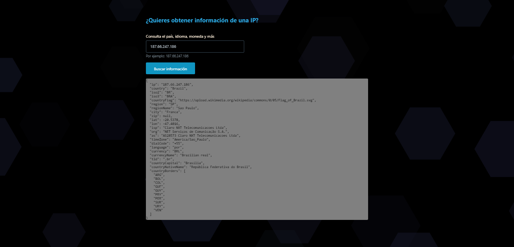

# Geolocation-IP

Proyecto de geolocalización de IP creado con JavaScript, consumiendo una API donde te devuelve los datos de la IP introducida. Podrás consultar país, idioma, moneda y más información.

Para la producción de este proyecto, he utilizado las siguientes herramientas: "Codi.link" como editor de código, "RapidAPI" para el consumo de la API, el Framework "Pico.css" para los estilos (adaptándolo a las necesidades del proyecto) y la librería "Particles.js" para agregar un fondo dinámico.

